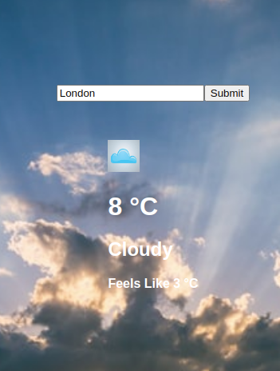
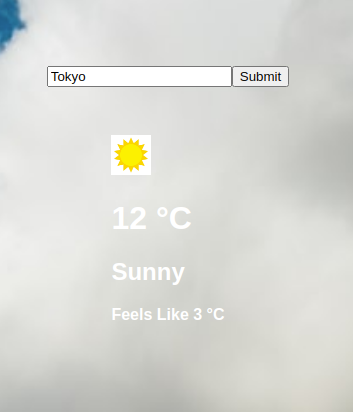
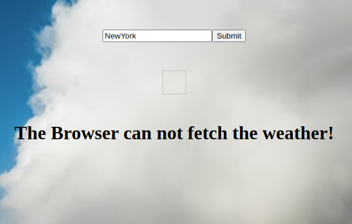

# Weather-app
This project is building a weather app to search for the temperature at any place in the world, using weather API and make handy use of promises or preferably async/await functions. 

## Description 
The app uses an async function that takes the location name as an argument and fetches weather data from OpenWeather API. 
An await fetch function is used to fetch the weather data from the API and the response is assigned to a variable.
The await fetch function accepts the API Url whose path is constructed from, a location name and key accessed through a subscription. 

### Form 
The form has a text input element and a submit button. A submit event listener function takes the text input and assigns it to the location. Then it calls the async function('weatherCondition') which takes the location as an argument.

### The Weather Div Element 
The weather Div element is the wrapper element of the displays of the weather condition. 
It displays temperature, sky condition, feel_like temperature, and the weather icon. 

### The async - 'weatherCondition(location)' function
The 'weatherCondition' function is an async function that has an await fetch function inside it. It fetches API data, assigns values to a weather object, and calls the 'showWeather' function to display the weather data in the browser. 

### The showWeather function
The showWeather function accepts the weather object as an argument and assigns the values as innerText to the respective HTML elements of the HTML skeleton. 

### Dynamic css
The showWeather function dynamically changes the background and the weather icon images based on the fetched weather condition. 

### Demo 
- Cloudy weather

- Sunn weather

- Error message 

## Built With

- Javscript
- HTML/CSS
- Webpack 
- npm 
- package.json
- openweather API 

## Live Link
[Weather-app](https://henatan99.github.io/Weather-app/)

## Authors

👤 **Henok Mossissa**

- GitHub: [@henatan99](https://github.com/henatan99)
- Twitter: [@henatan99](https://twitter.com/henatan99)
- LinkedIn: [Henok Mossissa](https://www.linkedin.com/in/henok-mekonnen-2a251613/)

## :handshake: Contributing

Contributions, issues, and feature requests are welcome!

## Show your support

Give a :star:️ if you like this project!

## Acknowledgment 
- OpenWeatherMap contributors 

## :memo: License

This project is [MIT](./LICENSE) licensed.
